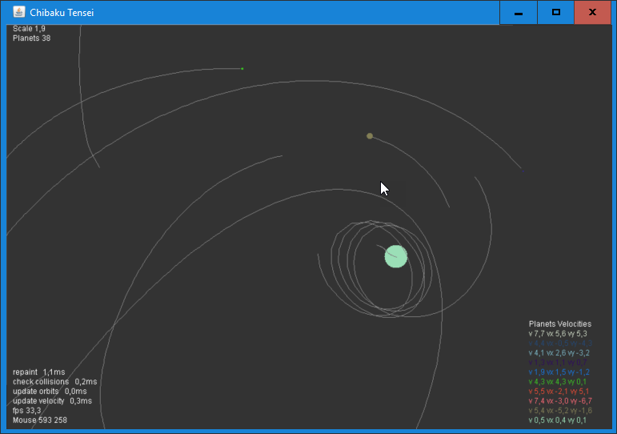

# ChibakuTensei - Planetary Devastation

### Create planets, watch them colliding or orbiting.

The solver uses classical Newtonian mechanics.

# Game

  * p pause
  * a add planet with velocity vector
  * i insert lots of planets at once
  * o toggle show orbits
  * e erase orbits

# Download 

Get the JAR file under [Actions](https://github.com/haphaeu/ChibakuTensei/actions)

# Project Status

